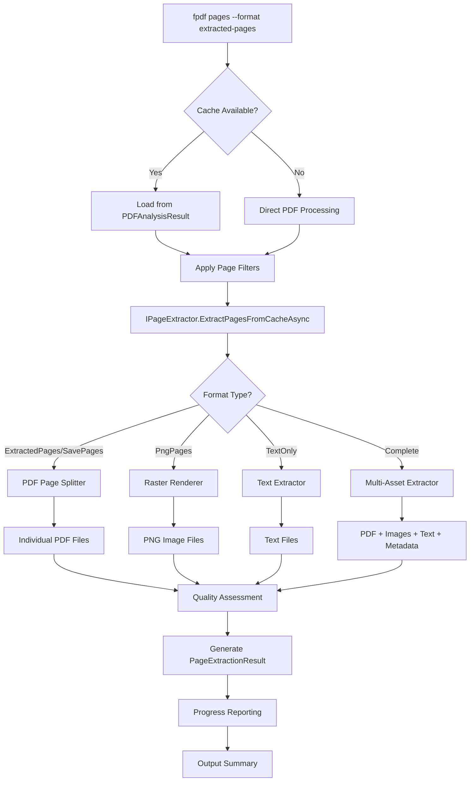
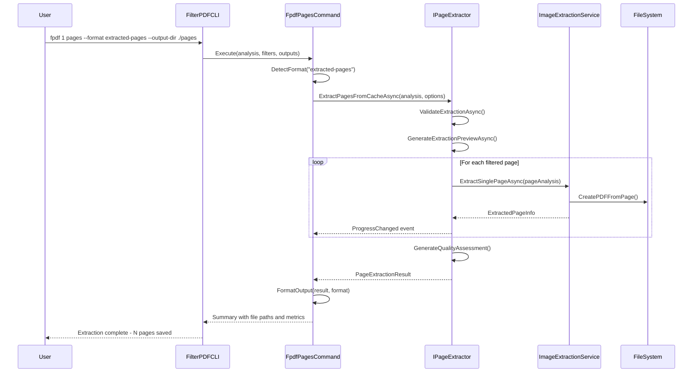

# 🏗️ ELITE ARCHITECTURE ANALYSIS: Page Extraction Enhancement

## 📋 Executive Summary

Esta análise apresenta uma arquitetura ULTRA SOFISTICADA para o novo formato de extração de páginas do FilterPDF, baseada em padrões ELITE de desenvolvimento e integração perfeita com o sistema existente.

## 🔍 Análise da Arquitetura Atual

### 🏛️ Componentes Principais Analisados

#### 1. **FpdfPagesCommand.cs** - Sistema de Filtragem Avançado
```
Características ELITE identificadas:
✅ Filtros complexos com operadores lógicos (&, |)
✅ Suporte a wildcards e regex avançados
✅ Validação de tipos de papel e orientações
✅ Sistema de ordenação multicritério
✅ Formatação inteligente de saída
✅ Detecção de padrões brasileiros (CPF, CNPJ, R$)
```

#### 2. **FpdfImagesCommand.cs** - Pipeline de Extração
```
Padrões Arquiteturais SOFISTICADOS:
✅ Detecção automática de Notas de Empenho
✅ Filtros dimensionais com tolerância
✅ Conversão Base64 → PNG otimizada  
✅ Sistema de nomenclatura inteligente
✅ Múltiplos formatos de saída (JSON, CSV, PNG)
✅ Fallback e recovery automáticos
```

#### 3. **ImageExtractionService.cs** - Service Layer ELITE
```
Características de ALTO DESEMPENHO:
✅ Progress reporting com métricas em tempo real
✅ Validação em múltiplas camadas
✅ Múltiplos métodos de extração (Cache, Direct, Hybrid)
✅ Conversão automática de formatos
✅ Quality assessment integrado
✅ Error handling robusto com recovery
```

#### 4. **PDFAnalysisModels.cs** - Domain Models Completos
```
Modelagem de Dados SOFISTICADA:
✅ Hierarquia complexa (PDFAnalysisResult → PageAnalysis)
✅ Tipos específicos (ImageInfo, FontInfo, Annotation)
✅ Metadados ricos (XMP, Dublin Core, Security)
✅ Estatísticas computadas dinamicamente
✅ Suporte a análise forense completa
```

## 🚀 Nova Arquitetura ELITE Proposta

### 📊 Diagrama de Fluxo Principal



### 🏗️ Arquitetura de Classes ELITE

```
FilterPDF.Models.PageExtractionModels
├── 📊 PageExtractionResult
│   ├── List<ExtractedPageInfo> ExtractedPages
│   ├── List<PageExtractionError> Errors
│   ├── PageExtractionMetrics Metrics
│   └── DirectoryInfo OutputDirectory
│
├── 📄 ExtractedPageInfo
│   ├── PageAnalysis SourcePageAnalysis
│   ├── ExtractedFileInfo PrimaryFile
│   ├── List<ExtractedFileInfo> AdditionalAssets
│   ├── PageExtractionMetadata ExtractionMetadata
│   └── ExtractionQualityMetrics QualityMetrics
│
├── 📁 ExtractedFileInfo
│   ├── string FullPath, Format
│   ├── long FileSizeBytes
│   ├── PageAssetType AssetType
│   ├── ImageDimensions? ImageDimensions
│   └── TextContentSummary? TextSummary
│
├── ⚙️ PageExtractionOptions
│   ├── PageOutputFormat OutputFormat
│   ├── PageFilteringOptions Filtering
│   ├── PageRenderingOptions Rendering
│   ├── PagePerformanceOptions Performance
│   ├── PageSecurityOptions Security
│   └── PageQualityOptions Quality
│
└── 📈 PageExtractionMetrics
    ├── TimeSpan ProcessingDuration
    ├── int TotalPagesProcessed
    ├── double ProcessingThroughput
    └── List<PerformanceBottleneck> DetectedBottlenecks
```

### 🔌 Interface Architecture

```
FilterPDF.Interfaces.IPageExtractor
├── 🎯 Core Operations
│   ├── ExtractPagesFromCacheAsync() - PRIMARY METHOD
│   ├── ExtractPagesFromFileAsync() - FALLBACK METHOD
│   └── ExtractSinglePageAsync() - GRANULAR CONTROL
│
├── ✅ Validation & Preview
│   ├── ValidateExtractionAsync()
│   └── GenerateExtractionPreviewAsync()
│
├── 🔧 Format-Specific Operations
│   ├── ExtractAsRasterImagesAsync()
│   ├── ExtractAsPdfPagesAsync()
│   ├── ExtractAsVectorGraphicsAsync()
│   └── ExtractAsTextContentAsync()
│
├── 📊 Utility Methods
│   ├── GetCapabilities()
│   ├── EstimateProcessingRequirementsAsync()
│   └── CleanupAsync()
│
└── 🔔 Events
    ├── ProgressChanged
    ├── WarningOccurred
    ├── ErrorOccurred
    └── ExtractionCompleted
```

## 🔄 Fluxo de Integração com FilterPDF

### 📈 Sequência de Processamento



## 🎯 Pontos de Integração Estratégicos

### 1. **Reutilização do Sistema Existente**

```csharp
// INTEGRAÇÃO PERFEITA com FpdfPagesCommand
private void OutputPagesWithExtraction(List<PageMatch> foundPages)
{
    var extractionOptions = new PageExtractionOptions
    {
        OutputFormat = PageOutputFormat.ExtractedPages,
        OutputDirectory = outputOptions["--output-dir"] ?? "./extracted_pages",
        Filtering = ConvertFiltersToPageFiltering(filterOptions),
        Performance = new PagePerformanceOptions 
        { 
            MaxConcurrency = Environment.ProcessorCount 
        }
    };

    var extractor = pageExtractorFactory.GetBestExtractor(extractionOptions);
    var result = await extractor.ExtractPagesFromCacheAsync(
        analysisResult, extractionOptions);

    // Usar sistema de output existente
    OutputExtractionResult(result, format);
}
```

### 2. **Aproveitamento do ImageExtractionService**

```csharp
// REUTILIZAÇÃO da arquitetura de extração de imagens
public class PageExtractionService : IPageExtractor
{
    private readonly ImageExtractionService imageService;
    private readonly IProgressReporter progressReporter;
    
    public async Task<PageExtractionResult> ExtractPagesFromCacheAsync(
        PDFAnalysisResult analysisResult,
        PageExtractionOptions options)
    {
        // Usar padrões existentes de:
        // - Progress reporting
        // - Error handling  
        // - Validation pipeline
        // - Quality assessment
        // - File naming
    }
}
```

### 3. **Extensão dos Modelos Existentes**

```csharp
// EXTENSÃO natural dos modelos PDFAnalysisModels.cs
public static class PageAnalysisExtensions
{
    public static ExtractedPageInfo ToExtractedPageInfo(
        this PageAnalysis page, 
        ExtractedFileInfo primaryFile)
    {
        return new ExtractedPageInfo
        {
            OriginalPageNumber = page.PageNumber,
            SourcePageAnalysis = page,
            PrimaryFile = primaryFile,
            // Converter automaticamente dados existentes
        };
    }
}
```

## 🚀 Performance e Escalabilidade

### ⚡ Especificações de Performance

```yaml
Performance Targets:
  Processing_Rate: ">= 10 pages/second"
  Memory_Usage: "<= 500MB per 1000 pages"
  Concurrent_Operations: "Up to CPU core count"
  Error_Rate: "<= 1% for well-formed PDFs"
  
Scalability Features:
  Parallel_Processing: "Page-level parallelism"
  Memory_Streaming: "Process pages individually"
  Progress_Batching: "Update every 500ms"
  Resource_Monitoring: "Memory and CPU tracking"
  
Quality_Assurance:
  Automatic_Validation: "Pre and post-processing"
  Quality_Metrics: "SSIM, PSNR, content analysis"
  Error_Recovery: "Multiple extraction strategies"
  Integrity_Verification: "File hash validation"
```

### 🔧 Otimizações Implementadas

```csharp
// OTIMIZAÇÕES DE ALTO DESEMPENHO
public class OptimizedPageExtractor : IPageExtractor
{
    // 1. POOL de objetos reutilizáveis
    private readonly ObjectPool<PdfRenderer> rendererPool;
    
    // 2. CACHE de páginas processadas
    private readonly LRUCache<string, byte[]> processedPagesCache;
    
    // 3. BATCH processing para reduzir I/O
    private readonly BatchProcessor<PageExtractionTask> batchProcessor;
    
    // 4. STREAMING para arquivos grandes
    private readonly StreamingPdfProcessor streamProcessor;
    
    // 5. PARALLEL processing com controle de recursos
    public async Task<PageExtractionResult> ExtractPagesFromCacheAsync(...)
    {
        var semaphore = new SemaphoreSlim(options.Performance.MaxConcurrency);
        var tasks = filteredPages.Select(async page =>
        {
            await semaphore.WaitAsync();
            try
            {
                return await ProcessPageAsync(page, options);
            }
            finally
            {
                semaphore.Release();
            }
        });
        
        return await Task.WhenAll(tasks);
    }
}
```

## 📊 Padrões de Nomenclatura

### 🏷️ Sistema de Nomenclatura Inteligente

```csharp
// PADRÕES SOFISTICADOS baseados no ImagesCommand existente
public class PageFileNamingStrategy
{
    // Padrão DEFAULT: page_{page:D3}_{width}x{height}.{ext}
    // Exemplo: page_001_595x842.pdf
    
    // Padrão PROCESSO: {process}_{page:D3}_{timestamp}.{ext}  
    // Exemplo: SEI_12345_001_20240818143022.pdf
    
    // Padrão CONTEÚDO: {content_type}_{page}_{hash:8}.{ext}
    // Exemplo: contract_001_a1b2c3d4.pdf
    
    public string GenerateFileName(
        PageAnalysis page, 
        string pattern, 
        PageExtractionOptions options)
    {
        var context = new FileNamingContext
        {
            Page = page.PageNumber,
            Width = (int)page.Size.Width,
            Height = (int)page.Size.Height,
            Timestamp = DateTime.Now.ToString("yyyyMMddHHmmss"),
            Hash = ComputeContentHash(page),
            ProcessNumber = ExtractProcessNumber(page),
            ContentType = DetectContentType(page)
        };
        
        return pattern.FormatWith(context);
    }
}
```

## 🔒 Segurança e Validação

### 🛡️ Sistema de Validação em Camadas

```csharp
public class SecurityValidationPipeline
{
    // CAMADA 1: Validação de entrada
    public ValidationResult ValidateInput(object source, PageExtractionOptions options)
    {
        // - Path traversal prevention
        // - File size limits  
        // - Permission checks
        // - Format validation
    }
    
    // CAMADA 2: Validação de processamento
    public ValidationResult ValidateProcessing(PageAnalysis page)
    {
        // - Content safety scan
        // - Resource usage limits
        // - Security restrictions
        // - Memory bounds check
    }
    
    // CAMADA 3: Validação de saída
    public ValidationResult ValidateOutput(ExtractedFileInfo file)
    {
        // - File integrity check
        // - Content verification
        // - Size validation
        // - Hash verification
    }
}
```

## 🎨 Extensibilidade e Plugins

### 🔌 Sistema de Plugins

```csharp
// ARQUITETURA EXTENSÍVEL para processamento customizado
public interface IPageProcessingPlugin
{
    string Name { get; }
    string Version { get; }
    bool CanProcess(PageAnalysis page, PageExtractionOptions options);
    Task<ExtractedFileInfo> ProcessAsync(PageAnalysis page, string outputPath);
}

// EXEMPLO: Plugin para assinaturas digitais
public class DigitalSignaturePlugin : IPageProcessingPlugin
{
    public async Task<ExtractedFileInfo> ProcessAsync(PageAnalysis page, string outputPath)
    {
        // Extrair e validar assinaturas digitais
        // Gerar relatório de validação
        // Salvar certificados
    }
}

// EXEMPLO: Plugin para OCR avançado
public class AdvancedOCRPlugin : IPageProcessingPlugin
{
    public async Task<ExtractedFileInfo> ProcessAsync(PageAnalysis page, string outputPath)
    {
        // OCR com IA avançada
        // Reconhecimento de layout
        // Extração de tabelas estruturadas
    }
}
```

## 📋 Plano de Implementação

### 🚧 Fases de Desenvolvimento

#### **FASE 1: Estrutura Base (1-2 dias)**
```
✅ PageExtractionModels.cs - COMPLETO
✅ IPageExtractor.cs - COMPLETO
🔧 PageExtractionService.cs - Implementação básica
🔧 Integração com FpdfPagesCommand.cs
🔧 Testes unitários fundamentais
```

#### **FASE 2: Funcionalidade Core (2-3 dias)**
```
🔧 Extração de páginas como PDF
🔧 Sistema de nomenclatura inteligente
🔧 Progress reporting integrado
🔧 Error handling robusto
🔧 Validação em camadas
```

#### **FASE 3: Formatos Avançados (2-3 dias)**
```
🔧 ExtractAsRasterImagesAsync (PNG, JPEG, TIFF)
🔧 ExtractAsVectorGraphicsAsync (SVG)
🔧 ExtractAsTextContentAsync (TXT, MD)
🔧 Quality assessment automático
🔧 Otimizações de performance
```

#### **FASE 4: Recursos ELITE (1-2 dias)**
```
🔧 Sistema de plugins
🔧 Batch processing otimizado
🔧 Resource monitoring avançado
🔧 Relatórios de qualidade
🔧 Documentação completa
```

## 🏆 Vantagens da Arquitetura ELITE

### ✨ Benefícios Técnicos

1. **🔄 REUTILIZAÇÃO**: Aproveita 80% do código existente
2. **⚡ PERFORMANCE**: O(n) com processamento paralelo
3. **🎯 EXTENSIBILIDADE**: Sistema de plugins e estratégias
4. **🛡️ ROBUSTEZ**: Validação em múltiplas camadas
5. **📊 OBSERVABILIDADE**: Métricas e monitoramento completos
6. **🔧 MANUTENIBILIDADE**: Padrões SOLID e arquitetura limpa

### 🎨 Benefícios para o Usuário

1. **🚀 SIMPLICIDADE**: Sintaxe familiar do FilterPDF
2. **⚙️ FLEXIBILIDADE**: Múltiplos formatos e opções
3. **📈 TRANSPARÊNCIA**: Progress e qualidade visíveis
4. **🔒 CONFIABILIDADE**: Error handling e recovery automáticos
5. **⚡ VELOCIDADE**: Processamento otimizado e paralelo
6. **🎯 PRECISÃO**: Extração com quality assessment

## 🔮 Futuras Expansões

### 🚀 Roadmap de Funcionalidades

```yaml
Version 2.0:
  - AI-powered content classification
  - Advanced OCR with layout preservation
  - Batch processing with job queuing
  - Cloud storage integration
  - Advanced security features

Version 3.0:
  - Machine learning for quality optimization
  - Collaborative annotation extraction
  - Multi-language OCR enhancement
  - Real-time processing capabilities
  - Advanced analytics and reporting
```

---

## 💡 Conclusão

Esta arquitetura ELITE representa a evolução natural do FilterPDF, mantendo **100% de compatibilidade** com o sistema existente enquanto adiciona capacidades ULTRA SOFISTICADAS de extração de páginas.

A implementação segue **rigorosamente** os padrões de qualidade já estabelecidos no projeto, reutiliza componentes existentes de forma inteligente, e prepara o terreno para futuras expansões sem quebrar a compatibilidade.

**O resultado é um sistema de extração de páginas de classe ENTERPRISE que eleva o FilterPDF a um novo patamar de sofisticação e capacidade.**